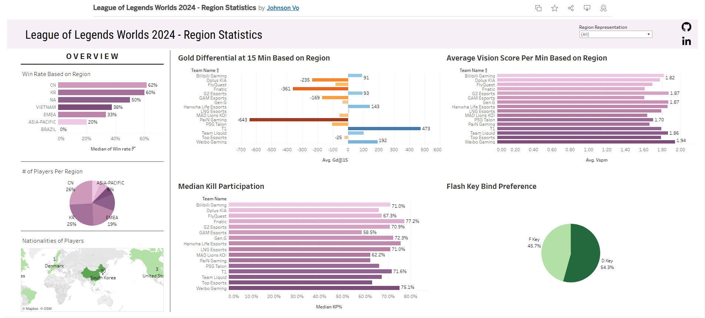

# Johnson Vo - Data Analyst Portfolio

## Table of Contents
 - [**About**](#About)
 - [**Education/Certificates**](#educationcertificates)
 - [**Projects**](#Projects)
  - [**SQL**](#SQL)
    - [Laptop Specifications for Digital Applications](#laptop-specifications-for-digital-applications)
  - [**R**](#R)
    - [How to Promote Physical Activity at the Gym?](#how-to-promote-physical-activity-at-the-gym)
  - [**Tableau**](#Tableau)
    - [League of Legends Worlds 2024 - Region Statistics](#League-of-Legends-Worlds-2024---Region-Statistics)
 - [**Contacts**](#Contacts)

## About
Hello, my name is Johnson Vo. I have a Bachelors of Arts in Business Economics, and an Associates in Economics and Natural Sciences. I am passionate about learning new things and pushing myself to do more. Through much of my rigorous coursework and self-study, I became proficient in Excel, Powerpoint, SQL, R, and Tableau. Using my skills that I was taught in through university and self-study, I am eager to put my technical and analytical skills to work. 

Using the skills I have learned, I have developed the ability to work with complex data using my knowledge of SQL, Excel, and R. By formatting, cleaning, and visualizing data through the usage of SQL, I have learned how data conveys a deeper story than what is seen at a glance. With the application of my technical skills, I have learned how to apply my knowledge in Economics to the data.

This is a repository displaying my projects and skills I have learned throughout my journey to analyze data

My resume can be found here: [Resume](https://github.com/jehnsun/DataPortfolio/blob/main/Resume%20Data%20Analytics-%20Johnson%20Vo%20.pdf)

## Education/Certificates

- **University of Caliornia, Irvine: Bachelor of Arts in Business Economics**
  - Sept. 2022 - June 2024
    
- **Pasadena City College: Associate of Arts in Economics**
  - Sept. 2020 - May 2022
    
- **Pasadena City College: Associate of Arts in Natural Sciences**
  - Sept. 2020 - May 2022
    
- **Google Data Analytics Professional Certificate**
  - Mar. 2024 - Oct. 2024  


## Projects


### SQL
------

#### Laptop Specifications for Digital Applications

**Description:** The data offers insight about 3000+ laptops within the market; this includes: model number, manufacturer, CPU, GPU, RAM, storage, and many more. By breaking down the data into price ranges, one is able to understand the price range in which majority of laptops fall under. This is valuable as it allows developers to create a program that most consumers can run and limit the amount of potential bugs at launch.

**Goal:** Create a reference point of laptop specifications, for developers to use to create their program.

**Files:** [Files](https://github.com/jehnsun/case_study_laptop_specifications_9_23_24/tree/main)

**Code:** [Laptop Specifications for Digital Applications](https://github.com/jehnsun/case_study_laptop_specifications_9_23_24/blob/main/SQL%20script%20for%20laptops.sql)


**Skills:** Data Formatting, Cleaning, Visualizing

**Technical:** SQL, Tableau, Excel, Powerpoint

**Code Used**
```SQL 
SET SQL_SAFE_UPDATES = 0;
#Allows users to permanently update the dataset

UPDATE laptop_prices_9_23_24.`laptop`
set SSD = REPLACE(TRIM(SSD), 'NO SSD', 'NA');
#Replaced missing values from the original table within the SSD with 'NA'

UPDATE laptop_prices_9_23_24.`laptop`
SET SSD = REPLACE(TRIM(SSD), ' GB SSD Storage', ''); 
#Removed unnecessary strings from the original data
#Meant to give the user pure numbers for easier calculation

UPDATE laptop_prices_9_23_24.`laptop`
set HDD = REPLACE(TRIM(HDD), 'No HDD', 'NA');
#Replaced missing values from the original table within the HDD column with 'NA'

UPDATE laptop_prices_9_23_24.`laptop`
SET HDD = REPLACE(TRIM(HDD), ' GB HDD Storage', '');
#Removed unnecessary strings from the original data
#Meant to give the user pure numbers for easier calculation

UPDATE laptop_prices_9_23_24.`laptop`
set RAM = REPLACE(TRIM(RAM), ' LP', '');
#Removed unnecessary strings from the original data
#Meant to give the user pure numbers for easier calculation

UPDATE laptop_prices_9_23_24.`laptop`
set RAM = REPLACE(TRIM(RAM), ' RAM', '');
#Removed unnecessary strings from the original data
#Meant to give the user pure numbers for easier calculation

UPDATE laptop_prices_9_23_24.`laptop`
SET RAM = REPLACE(RAM, ' GB', '');
#Removed unnecessary strings from the original data
#Meant to give the user pure numbers for easier calculation

UPDATE laptop_prices_9_23_24.`laptop`
SET RAM_TYPE = REPLACE(TRIM(RAM_TYPE), ' RAM', '');
#Removed unnecessary strings from the original data

UPDATE laptop_prices_9_23_24.`laptop`
SET Processor_Name = REPLACE(TRIM(Processor_Name), ' Processor', '');

UPDATE laptop_prices_9_23_24.`laptop`
SET GPU = CASE 
			WHEN GPU = ''
            THEN 'NA'
            WHEN GPU = 'Graphics'
            THEN 'NA'
            ELSE GPU
            END;
#Removed unknown data with the GPU column
#9 Rows have been changed

DELETE FROM laptop_prices_9_23_24.`laptop`
WHERE (`SSD`< 256 AND `HDD` < 256 );
#Removed potential faulty data (approx. 100 rows deleted)
#Went from 3975 rows to 3875

DELETE FROM laptop_prices_9_23_24.`laptop`
WHERE Ghz = 0;
#222 rows deleted
#Deleted rows where Ghz = 0 b/c the rows did not have a specific processor_name

ALTER TABLE laptop_prices_9_23_24.`laptop`
RENAME COLUMN Price to USD;

UPDATE laptop_prices_9_23_24.`laptop`
SET USD = (USD*0.012);

#9/27 Converted the prices of indian rupee to USD

select
	TRIM(Brand) as Brand,
    TRIM(Processor_Name) AS `CPU`,
    TRIM(Processor_Brand) AS CPU_BRAND,
    TRIM(RAM) AS `RAM(GB)`,
    #Trims unneccesary spaces within the dataset and renamed the columns
    CASE
		WHEN RAM_TYPE = 'RAM'
        THEN 'NA'
        ELSE RAM_TYPE
        END as RAM_TYPE,
		#Subquery to clean data. These lines remove the unneccessary spaces within the data and singles
        #out the values with only 'RAM' and replaces them with 'NA'
	CASE
        TRIM(GPU)
        WHEN INSTR(GPU, ',') = 0
        THEN LEFT(GPU, (INSTR(GPU,' GPU')-1))
		ELSE GPU
        END AS 'GPU',
	#Cleaned out the data to only show the GPU model
    #Currently using MySQL to run the functions, hence why I decided to use this subquery
    #Unable to use CHARINDEX() and SUBSTRING_INDEX() due to MySQL limitations
    CAST(
		(CASE
		WHEN SSD = 'NA'
        THEN 0
        ELSE SSD
		END) AS double) as `SSD(GB)`,
	CAST(
		(CASE
		WHEN HDD = 'NA'
        THEN 0
        ELSE HDD
        END) as double) as`HDD(GB)`,
	#Subquery to clean out the data similar to RAM_TYPE, whereas it replaces NA values with 0 
    #indicating no storage.
    #Purpose is to allow the subquery to convert the data from string into working numbers in order
    #to perform necessary calculations. 
	ROUND(USD, 2) AS USD
    #Converted Indian Rupee to USD then rounded to the nearest hundredths
from
	laptop_prices_9_23_24.`laptop`
where
	USD BETWEEN 500 AND 1000;
```


------
### R
------

#### How to Promote Physical Activity at the Gym?

**Description:** The data reveals physical attributes and effects of workout of over 900+ gym members. The data includes: Age, Gender, Avg_BPM, Session_Duration, Workout_Type, and more. In order to better understand the dataset, visualizations must be created to help gym owners develop a better grasp on their overall demographic. This allows gym owners to potentially understand how to target their marketing to certain audiences and potentially increase members' physical activity.

**Goal:** Visualize the dataset to reveal potential solutions to increase physical activity at the gym.

**Dataset:** [Gym Members Exercise Dataset by Vala Kohrasani](https://www.kaggle.com/datasets/valakhorasani/gym-members-exercise-dataset)

**Rmd(Code):** [Rmd](https://github.com/jehnsun/gym_analysis_10_22_24/blob/main/R%20Markdown%20-%20Gym%20Dataset%2010.22.24.Rmd)

**Result(PDF View):** [PDF](https://github.com/jehnsun/gym_analysis_10_22_24/blob/main/R-Markdown%20-%20Gym-Dataset-10.22.24.pdf)

**Skills:** Data Analysis, Data Visualization

**Technical:** Tidyverse (R)

**Code Used**

```R
# Load the tidyverse package
library('tidyverse') 

# Import the dataset
gym <- 
  read_csv(
    "C:/Users/Johns/Desktop/Data Files/CSV Files/gym_members_exercise_tracking.csv"
    )
# Structure of the dataset
str(gym)

gym_levels <- gym %>% 
  mutate(experience = case_when(
    Experience_Level == 1 ~ "Beginner",
    Experience_Level == 2 ~ "Intermediate",
    Experience_Level == 3 ~ "Advanced"
  ))

# Graphs the the type of workout most gym members decide to do based on
# experience level. 

ggplot(data = gym_levels) + 
  geom_bar(mapping = aes(x = Gender, fill = Gender)) +
  scale_fill_manual(values = c('#1c8d3b', '#0c3918'))+
  facet_wrap(~experience) +
  labs(title = "# of Members Based on Experience",
       caption = "Source: Gym Members Excercise Dataset") +
  ylab("# of Gym Members") +
  guides(fill = guide_legend(title = "Workout"))
# Calculates the amount of males and females in the gym
sex <- gym %>% 
  count(Gender = case_when(
    Gender == "Male" ~ "Male",
    Gender == "Female" ~ "Female"
  )) %>% 
  mutate(`%` = round(n/nrow(gym), 4) * 100) %>% 
  mutate(raw = round(n/nrow(gym), 4))


# Prints out the data frame
sex

# Rearranges values to in dataframe

sex <- arrange(sex, desc(n))

# Visualizes the amount of men and women that attend the gym

ggplot(data = sex) +
  geom_col(mapping = aes(x="", y = raw, fill = Gender)) +
  geom_text(aes(x="", y=raw, label = paste(`%`, '%', sep = "")), 
            position = position_stack(vjust = 0.5)) +
  coord_polar("y", start = 0) +
  theme_void() +
  scale_fill_manual(values = c('#d88fea', '#FFC300')) +
  labs(title = "Percentage of Men and Women at the Gym",
       caption = "Source: Gym Members Exercise Dataset")
  
ggplot(data = gym_levels) +
  geom_bar(mapping = aes(x = Workout_Type, fill = Workout_Type)) +
  scale_fill_manual(values = c('#31ff69', '#29d257', '#1c8d3b', '#0c3918')) +
  facet_grid(~experience) +
  labs(title = "Workout Type Based on Experience",
       caption = "Source: Gym Members Excercise Dataset")+
  ylab("# of Members") +
  xlab("Workout Type") +
  guides(fill = guide_legend(title = "Workout"))

# Generating box-whisker plot

ggplot(data = gym_levels) +
  geom_boxplot(aes(x = experience, y = `Session_Duration (hours)`, 
                   fill = Gender)) +
  facet_wrap(~Gender) +
  guides(fill = "none") +
  scale_fill_manual(values = c('#d88fea', '#FFC300')) +
  labs(title = "Median Age Based on Experience and Sex",
       caption = "Source: Gym Members Excercise Dataset") +
  ylab("Session Duration (hrs)") +
  xlab("Experience")
# Identifying the correlation between session duration and calories burned
round(cor(gym_levels$`Session_Duration (hours)`, gym_levels$Calories_Burned, 
          use = "complete.obs"), 3)

# Initializing the values linear regression equation
activity_reg <- lm(gym_levels$Calories_Burned ~ 
                     gym_levels$`Session_Duration (hours)`)
activity_coeff <- coefficients(activity_reg)

activity_intercept <- activity_coeff[1]
activity_slope <- activity_coeff[2]

# Scatter plot with linear regression line
ggplot(data = gym_levels) +
  geom_jitter(mapping = aes(x = `Session_Duration (hours)`, 
                            y = Calories_Burned, color = Gender)) +
  scale_color_manual(values = c("#bb80b0", "#c8d855")) +
  geom_abline(intercept = activity_intercept, slope = activity_slope)+
  labs(title = "Calories Burned by Time Spent",
       caption = "Source: Gym Members Exercise Dataset") +
  ylab("Calories Burned") +
  xlab("Session Duration (Hrs)")
```

------
### Tableau
------



#### League of Legends Worlds 2024 - Region Statistics

**Description:** This is a interactive dashboard that displays the statistics of professional E-Sports Players from around the world competing for a tournament surrounding the game known as League of Legends. From the recent tournament known as League of Legends World Championship, players from all around the world are flown across the world to compete for a prize pool of over 2 million USD. 

**Dashboard:** [League of Legends Worlds 2024 - Region Statistics](https://public.tableau.com/app/profile/johnson.vo1109/viz/2024LeagueofLegendsWorldsPlayerStatistics/Dashboard1#2)

**Dataset:** [2024 LoL Championship Player Stats & Swiss Stage by Lunovian](https://www.kaggle.com/datasets/anmatngu/2024-lol-championship-player-stats-and-swiss-stage)

**Skills:** Data Visualization, Data Formatting 

**Technical:** Tableau, Excel

## Contacts
- LinkedIn: [Johnson Vo](https://www.linkedin.com/in/vo-johnson/)
- Email: johnsonvo277@gmail.com


